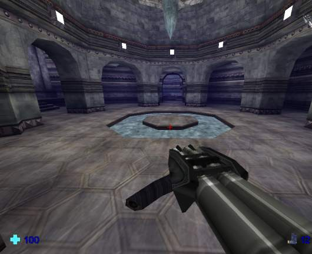



## CyberKiller 3D

### Description

This is full functional 3D action demo, written with visual basic with iRender 3D game engine usage (http://irender3d.com). The code is too big to upload it to PSC, so I decided to make a link to the file.
 
### More Info
 

             |
---                |---
**Submitted On**   |2005-01-30 10:34:20
**By**             |[iR\_OrBit](https://github.com/Planet-Source-Code/PSCIndex/blob/master/ByAuthor/ir-orbit.md)
**Level**          |Advanced
**User Rating**    |5.0 (109 globes from 22 users)
**Compatibility**  |VB 6\.0
**Category**       |[DirectX](https://github.com/Planet-Source-Code/PSCIndex/blob/master/ByCategory/directx__1-44.md)
**World**          |[Visual Basic](https://github.com/Planet-Source-Code/PSCIndex/blob/master/ByWorld/visual-basic.md)
**Archive File**   |[CyberKille1845701302005\.zip](https://github.com/Planet-Source-Code/ir-orbit-cyberkiller-3d__1-58569/archive/master.zip)

